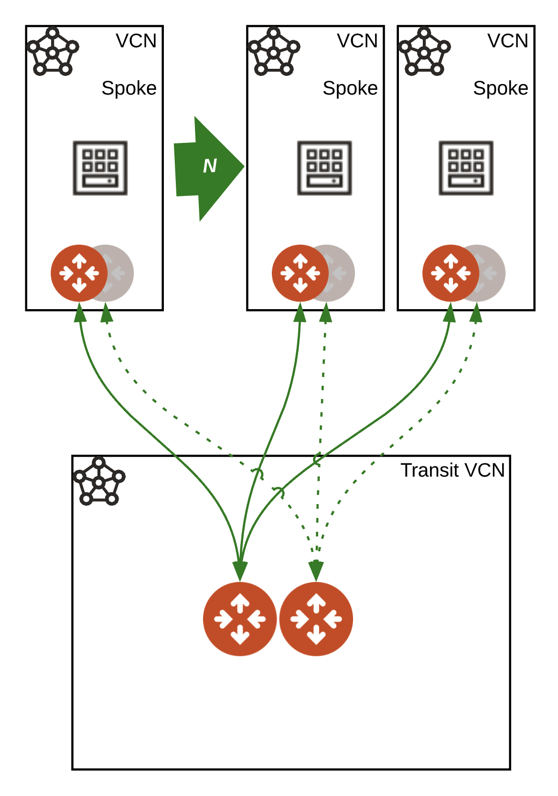

# Aviatrix Transit OCI with Flexible Shape Test VMs

### Summary

This repo builds Aviatrix Transit in OCI, spokes attached each with an OEL Flexible shape test vm in each. 
The test VMs will use a public ssh key you define in the terraform.tfvars have port 22 open and be provided public IPs. The test vm object(s) will be generated per spoke review output for public ip's.

### BOM

- 1 Aviatrix Transit in OCI with **_N_** Aviatrix spokes defined in terraform.tfvars, i.e. ```oci_spokes``` that will be attached to Aviatrix Transit Gateway.

### Infrastructure diagram



### Compatibility
Terraform version | Controller version | Terraform provider version
:--- | :--- | :---
0.13 | 6.3 | 2.18

### Modules

Module Name | Version | Description
:--- | :--- | :---
[terraform-aviatrix-modules/oci-transit/aviatrix](https://registry.terraform.io/modules/terraform-aviatrix-modules/oci-transit/aviatrix/latest) | 3.0.1 | This module deploys a VCN with Aviatrix transit gateways.
[terraform-aviatrix-modules/oci-spoke/aviatrix](https://registry.terraform.io/modules/terraform-aviatrix-modules/oci-spoke/aviatrix/latest) | 3.0.0 | This module deploys a VCN and an Aviatrix spoke gateway in OCI and attaches it to an Aviatrix Transit Gateway
[oci-flex-vm](./modules/flex-compute) | N/A | Local OCI module to deploy Flex virtual machines
[network-security-groups](,/modules/network-security-groups) | N/A | Local OCI module to create NSGs

### Variables

The variables are defined in ```terraform.tfvars```.

**Note:** ```ha_enabled = false``` controls whether ha is built for spokes. 

```instance_size``` controls the size of all the transit spokes and gateways. Default is ```StandardVM2.2```

Flexible Shapes used for the Test VMs are defined in detail [here.](https://docs.oracle.com/en-us/iaas/Content/Compute/References/computeshapes.htm) In this repo they are defaulted to 1 OCPU / 1 GB memory.

The Flexible shapes are **only** available in ``` us-ashburn-1, us-phoenix-1, eu-frankfurt-1, uk-london-1 ```

### Prerequisites

- Software version requirements met
- Aviatrix Controller with Access Account in OCI
- Sufficient limits in place for OCI region(s) in scope **_(Compute quotas, etc.)_**
- terraform .13 in the user environment ```terraform -v``` **_or use hashicorp/terraform docker image_** Instructions below.
- OCI Terraform provider requirements met on your workstation

### Workflow

- Modify ```terraform.tfvars``` _(i.e. access account name, regions, cidrs, etc.)_ and save the file.
- ```terraform init```
- ```terraform plan```
- ```terraform apply --auto-approve```

### Test command examples

#### iperf

Replace with the private IP of one of the created test vms - check OCI console for the value.
Run the client on one test vm and the server on another test vm.

```
iperf3 -c 10.21.3.20 -i 2 -t 30 -M 1400 -P 1 -p 5201
iperf3 -s -p 5201
```

### Deploy with hashicorp docker image

#### 1) Pull the 13.6 image
```
docker pull hashicorp/terraform:0.13.6
```
#### 2) Init in $PWD with environment variables set
```
docker run -i -t -v $PWD:$PWD -w $PWD \
--env TF_VAR_username=$TF_VAR_username \
--env TF_VAR_password=$TF_VAR_password \
--env TF_VAR_controller_ip=$TF_VAR_controller_ip \
hashicorp/terraform:0.13.6 init
```

#### 3) Plan in $PWD with environment variables set
```
docker run -i -t -v $PWD:$PWD -w $PWD \
--env TF_VAR_username=$TF_VAR_username \
--env TF_VAR_password=$TF_VAR_password \
--env TF_VAR_controller_ip=$TF_VAR_controller_ip \
hashicorp/terraform:0.13.6 plan
```

#### 4) Apply in $PWD with environment variables set
```
docker run -i -t -v $PWD:$PWD -w $PWD \
--env TF_VAR_username=$TF_VAR_username \
--env TF_VAR_password=$TF_VAR_password \
--env TF_VAR_controller_ip=$TF_VAR_controller_ip \
hashicorp/terraform:0.13.6 apply --auto-approve
```

